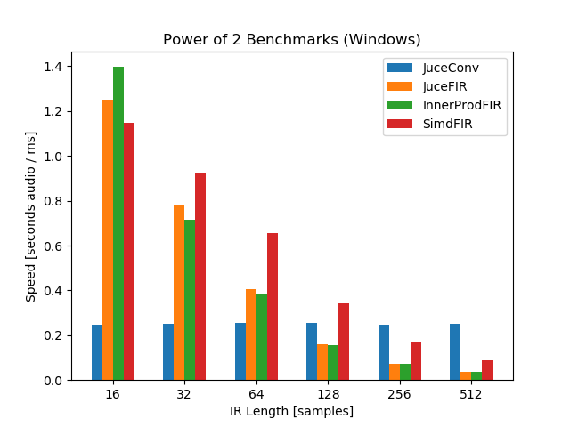
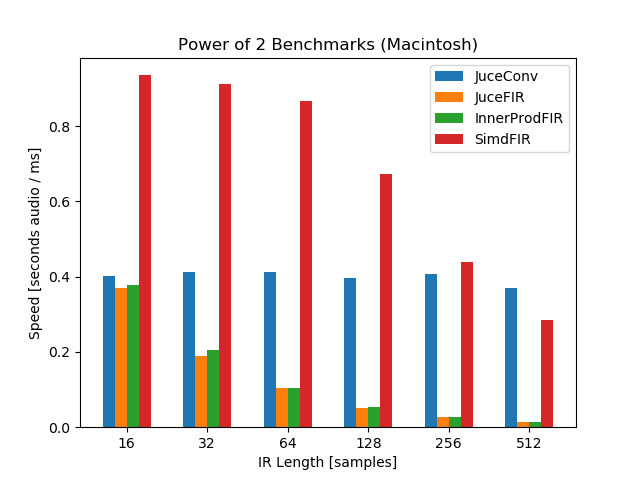

# FIR Filter Benchmarks

This repository contains benchmarks validating the performance
of various FIR filtering algorithms. Current algorithms include:
- [JUCE FIR Filter](https://docs.juce.com/master/classdsp_1_1FIR_1_1Filter.html)
- [JUCE Convolution](https://docs.juce.com/master/classdsp_1_1Convolution.html)
- [std::inner_product](https://en.cppreference.com/w/cpp/algorithm/inner_produc)
- std::inner_product, double-buffered
- SIMD-acclerated inner product

For further explanation of each algorithm, please see this
[writeup](https://ccrma.stanford.edu/~jatin/Notebooks/FIRBenchmarks.html).

## Results

So far, I only have the results of the benchmarks from my machine
(a 2017 Dell laptop with an Intel i7 CPU).

 

For more results, see the `./results/figures/` directory.

Benchmark results and algorithm optimization from the community
is greatly appreciated!

## License

The code in this repository is licensed under the BSD 3-clause 
license. Enjoy!
